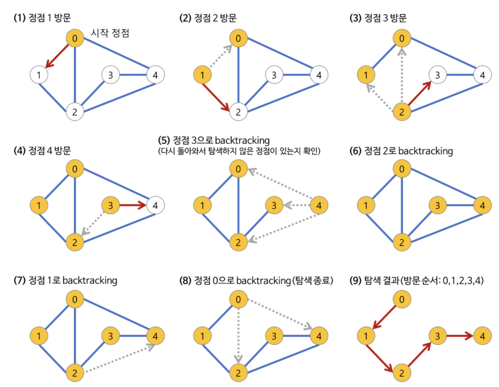

# 🧸 Algorithm - Baekjoon


## 📍Silver
- 1260(DFS와BFS)
- 10451(순열 싸이클)

### ⛏DFS (Stack)

- 자기 자신을 호출하는 순환 알고리즘의 형태를 지닌다 (재귀 or 스택)
  - 순환 호출 이용(재귀)
  - 명시적인 스택 사용 - > 스택 자료구조를 생성(Linked List)

- 방문노드 검사 필수

```java
// 재귀

// dfs, 재귀, 인접 행렬, i 정점부터 시작한다.
    public static void dfs(int i) {
		visit[i] = true;
		System.out.print(i + " ");
		
		for(int j=1; j<n+1; j++) {
			if((map[i][j] == 1 || map[j][i]) == 1)&& visit[j] == false) {
				dfs(j);
			}
		}
	}
```

- 