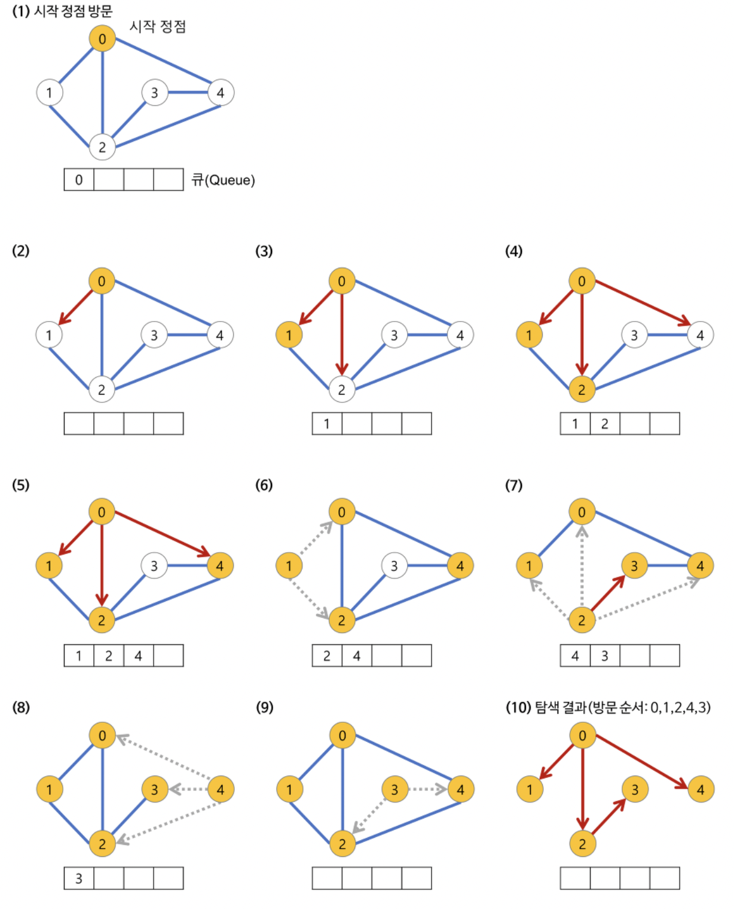

# 🧸 Algorithm - Baekjoon
 


## 📍 인상깊은 문제
- 토마토(7576번)
	- 처음 1에 해당하는 노드들을 큐에 넣어 탐색하도록 진행


### 🛠BFS (Queue)
- BFS는 재귀적으로 동작하지 않습니다.
- **방문노드 검사 필수**
	- 무한루프의 주요 원인
- **미로 탐색과 같은 최소의 경로 값을 구하는 것에 유용**
- 모든 노드에 똑같은 **가중치**를 부여한다
- 모든 정점을 방문할 필요가 없는 경우 사용


- 
- 


```java
// bfs, q사용, 인접행렬, i 정점부터 시작한다.
	public static void bfs(int i) {
		Queue<Integer> q = new LinkedList<>();
		q.offer(i);
		visit[i] = true;
		
		while(!q.isEmpty()) {
			int temp = q.poll();
			System.out.print(temp + " ");
			for(int j=1; j<n+1; j++) {
				if((map[temp][j] == 1|| map[j][temp]) == 1 && visit[j] == false) {
					q.offer(j);
					visit[j] = true;
				}
			}
		}
	}
```